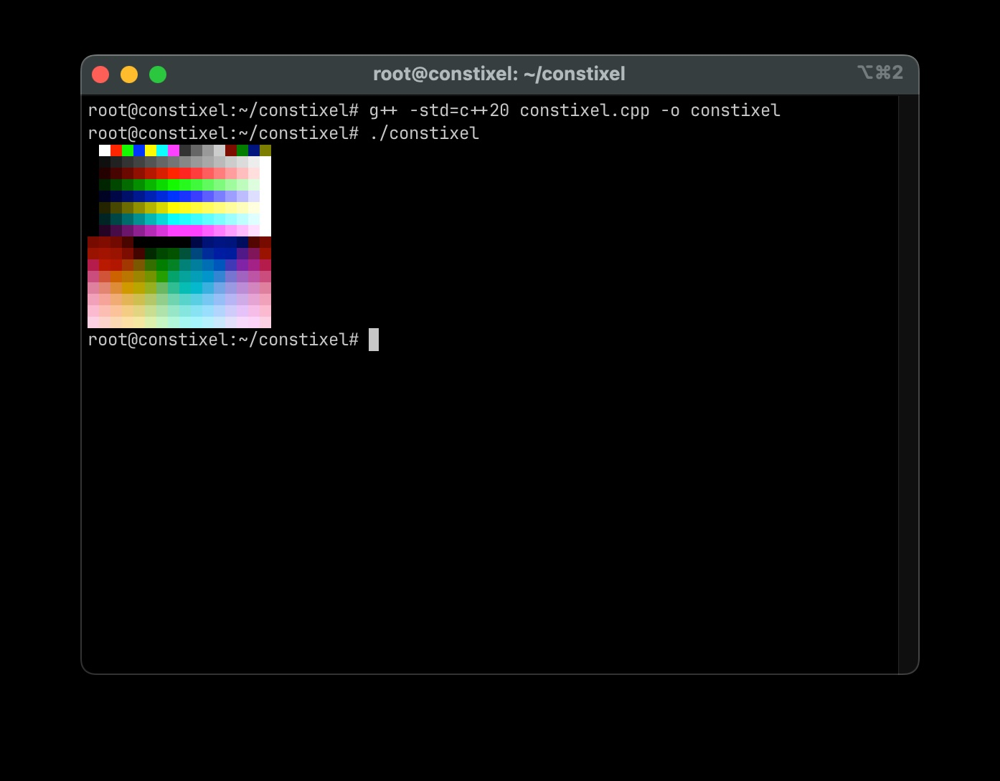
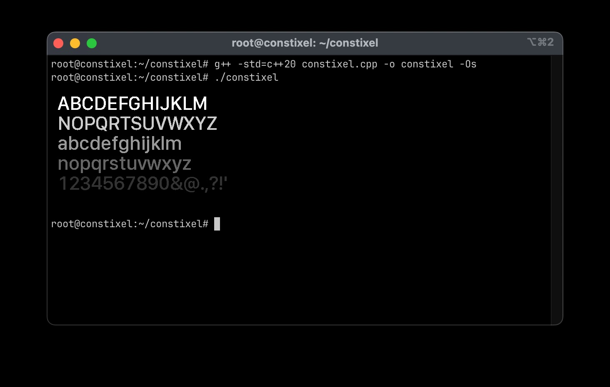
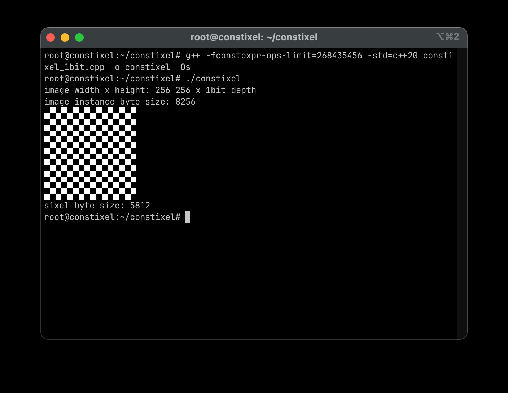

# constixel

[](https://github.com/tinic/constixel/actions/workflows/cmake-multi-platform.yml)
[](https://github.com/tinic/constixel/actions/workflows/codeql.yml)
[](https://github.com/tinic/constixel/actions/workflows/msvc.yml)

constixel is a single header minimalistic constexpr C++20(+) 2d graphics palette based rendering library with the ability to output to a sixel image stream which can be viewed in most modern terminals.

##### Table of Contents  
[Primary features and goals](#primary-features-and-goals)  
[Applications](#applications)  
[Requirements](#requirements)  
[Minimal example](#minimal-example)  
[Text drawing example](#text-drawing-example)  
[Consteval sixel example](#consteval-sixel-example)  
[Consteval image example](#consteval-embedded-image-data-example)  
[Saving a PNG to disk example](#saving-a-png-to-disk-example)  
[API](#api)  

## Primary features and goals

- Completely constexpr. All operations, including the sixel output stream can be generated during compilation.
- No dynamic allocations. The backbuffer and interal data structures can live as global static variables.
- Minimalistic interface and single header implementation so it can be used without fuzz in any modern C++ project.
- 1, 2, 4 and 8bit palette based back buffers for minimal memory usage. Reasonable standard palettes are provided.
- Blit raw 32-bit RGBA image buffers into the palette backed back buffer (with or without dithering). Also convert into a RGBA buffer when needed.
- Simple fill_rect, line and fill_circle drawing functions.
- Render proportional text with fonts genenerated by fontbm/bmfont. Project includes a set of pre-made fonts which are trivial to use. UTF-8 is supported.
- A simplistic uncompressed png encoder is included to reduce dependencies.
- Various other simple image manipulation operations.
- Code is cpplint compliant, passes cppcheck and is of course consteval runnable.
- Code compiles with "-Wall -Wextra -Wpedantic -Weffc++ -Werror" on so it can be easily used in any existing C++ project without creating noise.

> [!NOTE]
> This library is not designed for high fidelity graphics generation and should be more thought of a utility library for software development purposes. Despite that, on HiDPI screens like on Macs the results generally look fairly good.

## Applications

- Interface rendering on embedded devices.
- Send graphical data to your terminal through a serial connection from any embedded device.
- Add graphical output to unit tests.
- Programmatically render static graphical assets.
- Help debug dynamic memory handling issues in complex C++ projects.
- ...
  
## Requirements

- C++20
- gcc 14 or newer, clang 16 or newer, MSVC 17 or newer
- For viewing the sixel image you will need a capabable terminal. Windows Terminal, iTerm2 on MacOS and any Linux terminal will work.

> [!NOTE]
> The Terminal app on MacOS does not support sixel, please use iTerm2.

> [!NOTE]
> If you want to consteval either the sixel or image data you likely need to increase the constexpr ops limit. With g++ use '-fconstexpr-ops-limit=268435456' with clang use '-fconstexpr-steps=33554432'. The default limit in MSVC usually seems adequate.

## Minimal example

```c++
#include "constixel.h"

int main() {
    static constixel::image<constixel::format_8bit, 256, 256> image;

    for (int32_t y = 0; y < 16; y++) {
        for (int32_t x = 0; x < 16; x++) {
            image.fill_rect(x * 16, y * 16, 16, 16, static_cast<uint8_t>(y * 16 + x));
        }
    }

    image.sixel_to_cout();
}
```



## Text drawing example

Include a text font and pass the struct name as a template parameter to the draw_string function:

```c++
#include "constixel.h"
#include "fonts/sf_compact_display_medium_48_mono.h"

int main() {
    using namespace constixel;

    static constexpr std::array<const char *, 5> strings {
        "ABCDEFGHIJKLM", "NOPQRTSUVWXYZ", "abcdefghijklm", "nopqrstuvwxyz","1234567890&@.,?!'"""
    };

    image<format_8bit, 512, 312, 1> image;
    for (size_t i = 0; i < strings.size(); i++) { 
        uint8_t col = color::GREY_RAMP_STOP - static_cast<uint8_t>(i * 3);
        image.draw_string_mono<sf_compact_display_medium_48_mono>(16, 48 * static_cast<int32_t>(i) + 16, strings.at(i), col);
    }
    image.sixel_to_cout();
}
```



## Consteval sixel example

As std::vector can not escape consteval (yet) so we use std::array. Output of this example should be "Actual byte size: 18537" and the sixel image. The binary will contain the evaluated sixel string.

Compile as such:

```bash
> g++ -fconstexpr-ops-limit=268435456 -std=c++23 constixel.cpp -o constixel -Os
```

```c++
#include "constixel.h"

#include <cstring>

consteval auto gen_sixel() {
    constixel::image<constixel::format_8bit, 256, 256> image;

    for (int32_t y = 0; y < 16; y++) {
        for (int32_t x = 0; x < 16; x++) {
            image.fill_rect(x * 16, y * 16, 16, 16, static_cast<uint8_t>(y * 16 + x));
        }
    }

    std::array<char, 32767> sixel;
    char *ptr = sixel.data();
    image.sixel([&ptr](char ch) mutable {
        *ptr++ = ch;
    });
    *ptr++ = '\n';
    *ptr++ = 0;

    return sixel;
}

int main() {
    static const auto sixel = gen_sixel();

    std::cout << "Actual byte size: " << strlen(sixel.data()) << "\n";
    std::cout << sixel.data() << std::endl;
}
```

## Consteval embedded image data example

This example will consteval gen_image_1bit() into a std::array, while dynamically generating the sixel string.

```c++
#include "constixel.h"

#include <cstring>

consteval auto gen_image_1bit() {
    constixel::image<constixel::format_1bit, 256, 256, 1> image;
    for (int32_t y = 0; y < 16; y++) {
        for (int32_t x = 0; x < 16; x++) {
            image.fill_rect(x * 16, y * 16, 16, 16, static_cast<uint8_t>(y + x) & 1);
        }
    }
    return image;
}

int main() {
    static const auto image = gen_image_1bit();

    printf("image width x height: %d %d x 1bit depth\n", int(image.width()), int(image.height()));
    printf("image instance byte size: %d\n", int(image.size()));

    size_t count = 0;
    image.sixel([&count](char ch) mutable {
        putc(ch, stdout);
        count++;
    });
    putc('\n', stdout);

    printf("sixel byte size: %d\n", int(count));
}
```



## Saving a PNG to disk example

```
#include "constixel.h"
#include <iostream>
#include <filesystem>

int main() {
    static constixel::image<constixel::format_8bit, 256, 256> image;

    for (int32_t y = 0; y < 16; y++) {
        for (int32_t x = 0; x < 16; x++) {
            image.fill_rect(x * 16, y * 16, 16, 16, static_cast<uint8_t>(y * 16 + x));
        }
    }

    std::vector<char> out{};
    image.png([&out](char ch) mutable {
        out.push_back(ch);
    });

    std::ofstream file("constixel.png", std::ios::binary);
    file.write(reinterpret_cast<const char*>(out.data()), static_cast<std::streamsize>(out.size()));
}

```

## API

The following image formats are available. [Width] is the width in pixels, [Height] is the height in pixels. [Scale] is an optional parameter to specify a scale factor for the sixel output only. For instance setting this to 4 would scale the output of the sixel stream by a factor of 4.

```c++
    constixel::image<constixel::format_1bit, [Width], [Height], [Scale=1]>
    constixel::image<constixel::format_2bit, [Width], [Height], [Scale=1]>
    constixel::image<constixel::format_4bit, [Width], [Height], [Scale=1]>
    constixel::image<constixel::format_8bit, [Width], [Height], [Scale=1]>
```

The most important member function of image:

```c++
// Colors in the fixed internal palette
enum color : uint8_t {
    BLACK_TRANSPARENT = 0,
    BLACK_OPAQUE = 16,
    WHITE = 1,
    RED = 2,
    GREEN = 3,
    BLUE = 4,
    YELLOW = 5,
    CYAN = 6,
    MAGENTA = 7,
    GREY_80 = 8,
    GREY_60 = 9,
    GREY_40 = 10,
    GREY_20 = 11,
    DARK_RED = 12,
    DARK_GREEN = 13,
    DARK_BLUE = 14,
    DARK_YELLOW = 15
};

class image {
    // Size in bytes of the image buffer
    int32_t size();

    // Width in pixel of the image buffer
    int32_t width();

    // Height in pixels of the image buffer
    int32_t height();

    // Return a reference to the internal pixel buffer
    std::array<uint8_t, T<W, H, S>::image_size> &data_ref();

    // Return a clone of the internal pixel buffer
    std::array<uint8_t, T<W, H, S>::image_size> clone();

    // Clear the image, i.e. set everything to color 0
    void clear();

    // Copy another image into this instance. Overwrites the contents, no compositing occurs.
    void copy(const std::array<uint8_t, T<W, H, S>::image_size> &src);

    // Draw monochrome utf8 text. #include a monochrome font and specify the included struct as the template parameter.
    // Returns the current x caret position in pixels.
    template <typename FONT>
    constexpr int32_t draw_string_mono(int32_t x, int32_t y, const char *str, uint8_t col);

    // Draw smoothed utf8 text. #include a antialiased font and specify the included struct as the template parameter.
    // Returns the current x caret position in pixels.
    // NOTE 1: This only works with constixel::format_8bit images
    // NOTE 2: This is a very slow operation due to the brute force color quantization and will likely not consteval.
    template <typename FONT>
    constexpr int32_t draw_string_aa(int32_t x, int32_t y, const char *str, uint8_t col);

    // Get the width of a utf8 string in pixels. #include a monochrome or grey font and specify the included struct as the template parameter
    template <typename FONT>
    constexpr int32_t string_width(const char *str);

    // Draw a line
    void line(int32_t x0, int32_t y0, int32_t x1, int32_t y1, uint8_t col, uint32_t stroke_width = 1);
    void line(constixel::rect<int32_t> &l, uint8_t col, uint32_t stroke_width = 1);

    // Draw a filled rectangle
    void fill_rect(int32_t x, int32_t y, int32_t w, int32_t h, uint8_t col);
    void fill_rect(constixel::rect<int32_t> &r, uint8_t col);

    // Draw a stroked rectangle
    void stroke_rect(int32_t x, int32_t y, int32_t w, int32_t h, uint8_t col, uint32_t stroke_width = 1);
    void stroke_rect(constixel::rect<int32_t> &r, uint8_t col, uint32_t stroke_width = 1);

    // Draw a filled circle
    void fill_circle(int32_t x, int32_t y, int32_t r, uint8_t col);

    // Get a populated RGBA buffer with the contents of this instance.
    // Color 0 is special and will be set to 0x0000000 in the returned buffer, 
    // while all the other colors will be converted to a 0xffBBGGRR format.
    std::array<uint32_t, W * H> RGBA_uint32();
    std::array<uint8_t, W * H * 4> RGBA_uint8();

    // Blit an RGBA (little endian) buffer into this instance. Colors are quantizied to the internal palette. 
    // NOTE: This is a slow operation due to the brute force color quantization and will likely not consteval.
    void blit_RGBA(int32_t x, int32_t y, int32_t w, int32_t h, const uint8_t *ptr, int32_t iw, int32_t ih, int32_t stride);
    void blit_RGBA(const rect<int32_t> &r, const uint8_t *ptr, int32_t iw, int32_t ih, int32_t stride);

    // Blit an RGBA (little endian) buffer into this instance using line diffusion for better quality.
    // NOTE: This is a slow operation due to the brute force color quantization and will likely not consteval.
    void blit_RGBA_diffused(int32_t x, int32_t y, int32_t w, int32_t h, const uint8_t *ptr, int32_t iw, int32_t ih, int32_t stride);
    void blit_RGBA_diffused(const rect<int32_t> &r, const uint8_t *ptr, int32_t iw, int32_t ih, int32_t stride);

    // Blit an RGBA (little endian) buffer into this instance using line diffusion in linear color space for best quality.
    // NOTE: This is a very slow operation due to the brute force color quantization and will likely not consteval.
    void blit_RGBA_diffused_linear(int32_t x, int32_t y, int32_t w, int32_t h, const uint8_t *ptr, int32_t iw, int32_t ih, int32_t stride);
    void blit_RGBA_diffused_linear(const rect<int32_t> &r, const uint8_t *ptr, int32_t iw, int32_t ih, int32_t stride);

    // Generate an uncompressed png file. Provide a lambda function in the form of:
    //
    // image.png([](char ch) {
    //    [do something with the character]
    // });
    //
    void png(F &&charOut);

    // Convert the current instance into a sixel stream and output it to std::cout
    void sixel_to_cout();

    // Convert the current instance into a sixel stream. Provide a lambda function in the form of:
    //
    // image.sixel([](char ch) {
    //    [do something with the character]
    // });
    //
    // Optionally you can provide a rectangle to get a portion of the image only.
    //
    void sixel(F &&charOut, bool preserveBackground = true);
    void sixel(F &&charOut, const constixel::rect<int32_t> &r, bool preserveBackground = true);

}
```
